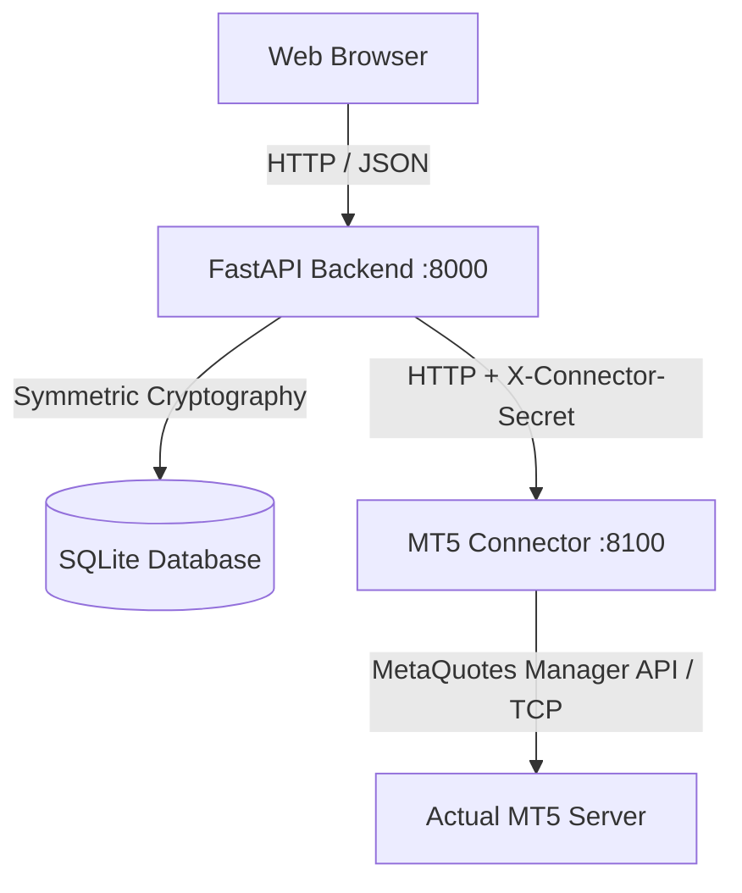
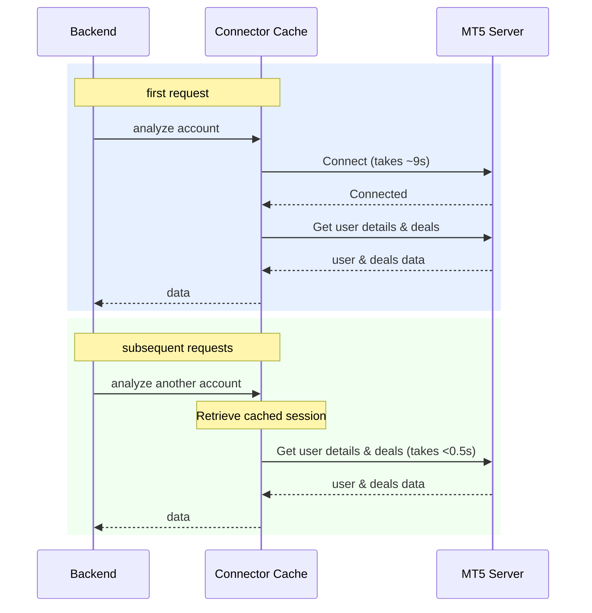

# MetaTrader 5 Broker Connection Architecture

This document describes how the platform connects to actual MetaTrader 5 (MT5) servers, retrieves trading accounts, and analyzes trade data.

---

## 1. Component Overview & Microservices

The application separates core SaaS logic from direct broker communication:



- **FastAPI Backend (`:8000`)**: Handles user authentication, organizations, audit logs, and configuration storage.
- **MT5 Connector (`:8100`)**: A lightweight FastAPI microservice responsible *only* for MT5 operations. This is the only component that directly initiates TCP sockets to broker servers.
- **Security**: The backend and connector communicate over HTTP. To prevent unauthorized requests, all endpoints on the connector require the `X-Connector-Secret` header, which contains a shared secret verified by the connector.

---

## 2. MetaTrader 5 Manager API

Connecting to a broker's main server requires administrative or manager-level credentials (as opposed to client-terminal credentials). 

- **Library**: The connector uses the `MT5Manager` Python library.
- **OS Requirement**: MetaQuotes compiles the native Manager API client libraries only as Win64 binaries (`.dll`). Therefore, the MT5 Connector microservice must run on a **Windows environment**.
- **Mode of Operation**:
  - **`mock` mode (Offline/Testing)**: Returns synthetic trade data, allowing offline execution on Linux or local development machines without network access to MT5 servers.
  - **`real` mode (Production)**: Connectes directly to the broker's MT5 server.

---

## 3. Connection Flow

When a user triggers an account analysis or logs a connection:

1. **Parameters Decryption**: The backend reads the broker connection credentials (`Server`, `Login`, and `Password`) from the database, decrypts the password using a symmetric Fernet key, and forwards it to the MT5 Connector.
2. **API Instantiation**: The connector initializes the Manager API client:
   ```python
   import MT5Manager
   manager = MT5Manager.ManagerAPI()
   ```
3. **Connecting**: The connection is established via the `Connect` method:
   ```python
   ok = manager.Connect(
       creds.server, 
       int(creds.login), 
       creds.password,
       PUMP_MODE_USERS, 
       timeout_ms
   )
   ```
   - **Pump Mode (`PUMP_MODE_USERS`)**: To avoid server network errors caused by excessive data streaming, the connector subscribes only to minimal data streams (`PUMP_MODE_USERS`). This provides access to user records and custom history requests.

---

## 4. Connection Cache & Heartbeat

Establishing a new TCP/TLS connection with an MT5 server takes approximately **9 seconds** due to API handshake operations.

To prevent high latency on every analysis call, the connector maintains a connection pool and heartbeat thread:



- **Caching**: Successful connections are stored in a global memory map:
  ```python
  _CACHE[(server, login, password)] = {"manager": manager, "last_used": time.time()}
  ```
- **Keepalive Thread (`mt5-keepalive`)**: A background daemon thread continuously runs in the background. Every `mt5_keepalive_sec` seconds (defined in config), it runs a cheap liveness check (`UserGet` query). If a socket drop or timeout is detected, it automatically calls `Connect` in the background to keep the session alive.

---

## 5. Account Retrieval & Trade Analysis

Once connected, the connector performs two principal operations:

### A. Retrieving User Information
Queries basic details of the client account via:
```python
user = manager.UserGet(int(account))
```
From the returned object, it extracts:
- `Name`: The trader's name.
- `LastIP`: The IP address of the trader's last client terminal login.
- `LastAccess`: Timestamp of the last activity, which is logged as their last login timestamp.

### B. Pulling Trade History
Retrieves all historical closed trades (deals) for the requested time range:
```python
deals = manager.DealRequestByLogins([account], start_timestamp, end_timestamp)
```

### C. Reconstructing Positions
MT5 databases store raw transactions (*deals*), not completed round-trip trades. The connector transforms these deals into analyzable positions:
1. Filters out non-trade items (like credit adjustments, deposits, withdrawals, or server corrections).
2. Correlates opening deals (`ENTRY_IN`) with closing deals (`ENTRY_OUT` or `ENTRY_INOUT`) by `PositionID`.
3. Determines if the trade was a `buy` or `sell` using the transaction `Action` code.
4. Aggregates financial items to calculate net profit:
   $$\text{Net Profit} = \text{Raw Profit} + \text{Swaps/Storage} + \text{Commissions} + \text{Fees}$$
5. Sorts the list by `open_time` and returns it to the backend.
